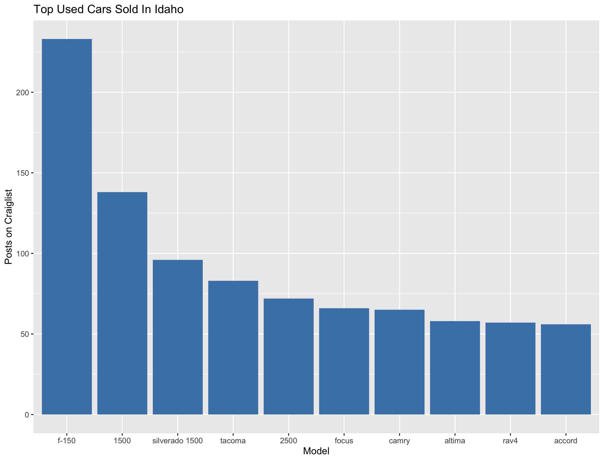
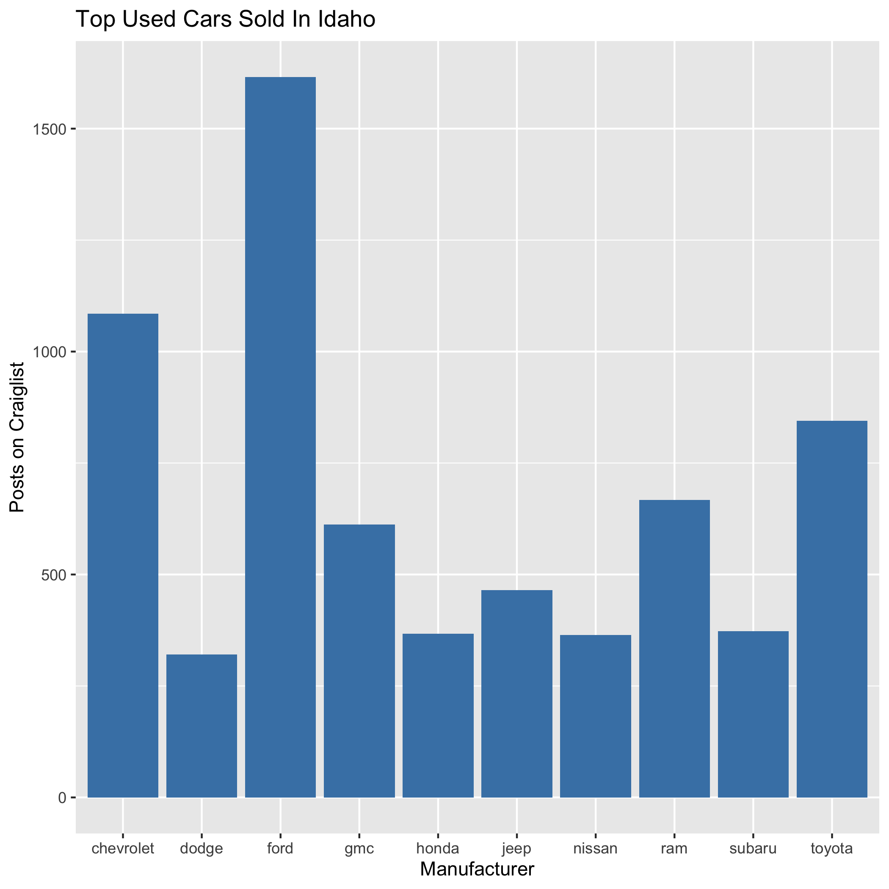
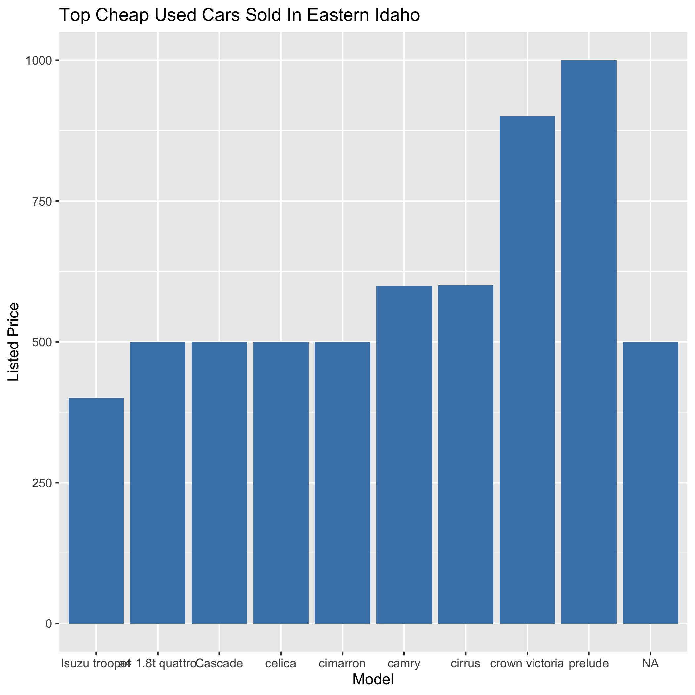

# Overview

Data analysis about cars posted on Craiglist made using R. The purpose of this program is to have an idea of the most selling used cars around me, a college student in Idaho.

The data is taken from Kaggle. The dataset includes every used vehicle posted on Craiglist from April to May 2021 in the entire United States. 

https://www.kaggle.com/datasets/austinreese/craigslist-carstrucks-data

**Note:** The dataset is too large to be uploaded here. You'll need to download it and put it in the data folder in order for the code to run. Download it using the link above.

Here's a video of me going through my questions and code.

[Software Demo Video](https://youtu.be/uLouZLShrPs)

# Data Analysis Results

#### What is the most popular used car sold in Idaho?

- According to the amount of listings on craiglist, the most popular used car in Idaho was the Ford F-150. And the most popular manufacturer was Ford.
- Here are two graphs to support those answers:

#### What was the cheapest car being sold in eastern Idaho?

- The cheapest car sold during that time was a 1990 Isuzu Trooper. Its listed price was only $400.
- 

# Development Environment

- R is the programming language.
- R studio is the IDE I chose for this project.
- I used the following libraries for R:
    - readr
    - tidyr
    - ggplot2
    - dplyr
    - lubridate

# Useful Websites

* [W3 Schools R Tutorial](https://www.w3schools.com/r/)
* [LinkedIn Course - Learning R](https://www.linkedin.com/learning-login/share?account=2153100&forceAccount=false&redirect=https%3A%2F%2Fwww.linkedin.com%2Flearning%2Flearning-r-2%3Ftrk%3Dshare_ent_url%26shareId%3DIdTQvPnFQg%252BN6DDvsC%252BiOw%253D%253D)

# Future Work

* Color the bars according to the frequencies. If it's greater than something, make the bar a different color.
* Include different kind of graphs, not only bar plots.
* Learn how to better deal with the N/A values.